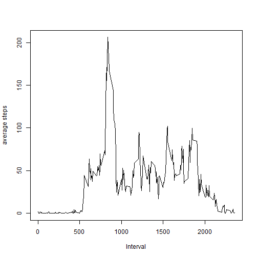

This is an R Markdown document. Markdown is a simple formatting syntax for authoring HTML, PDF, and MS Word documents. For more details on using R Markdown see <http://rmarkdown.rstudio.com>.

When you click the **Knit** button a document will be generated that includes both content as well as the output of any embedded R code chunks within the document. You can embed an R code chunk like this:


```r
mydata <- read.csv("activity.csv")
```


The total number of steps taken per day

```r
q1 <- aggregate(steps~date, data=mydata,sum)
print(q1)
```

```
##          date steps
## 1  2012-10-02   126
## 2  2012-10-03 11352
## 3  2012-10-04 12116
## 4  2012-10-05 13294
## 5  2012-10-06 15420
## 6  2012-10-07 11015
## 7  2012-10-09 12811
## 8  2012-10-10  9900
## 9  2012-10-11 10304
## 10 2012-10-12 17382
## 11 2012-10-13 12426
## 12 2012-10-14 15098
## 13 2012-10-15 10139
## 14 2012-10-16 15084
## 15 2012-10-17 13452
## 16 2012-10-18 10056
## 17 2012-10-19 11829
## 18 2012-10-20 10395
## 19 2012-10-21  8821
## 20 2012-10-22 13460
## 21 2012-10-23  8918
## 22 2012-10-24  8355
## 23 2012-10-25  2492
## 24 2012-10-26  6778
## 25 2012-10-27 10119
## 26 2012-10-28 11458
## 27 2012-10-29  5018
## 28 2012-10-30  9819
## 29 2012-10-31 15414
## 30 2012-11-02 10600
## 31 2012-11-03 10571
## 32 2012-11-05 10439
## 33 2012-11-06  8334
## 34 2012-11-07 12883
## 35 2012-11-08  3219
## 36 2012-11-11 12608
## 37 2012-11-12 10765
## 38 2012-11-13  7336
## 39 2012-11-15    41
## 40 2012-11-16  5441
## 41 2012-11-17 14339
## 42 2012-11-18 15110
## 43 2012-11-19  8841
## 44 2012-11-20  4472
## 45 2012-11-21 12787
## 46 2012-11-22 20427
## 47 2012-11-23 21194
## 48 2012-11-24 14478
## 49 2012-11-25 11834
## 50 2012-11-26 11162
## 51 2012-11-27 13646
## 52 2012-11-28 10183
## 53 2012-11-29  7047
```

```r
hist(q1$steps,breaks=30, main="Total steps taken per day", xlab="Sum of steps", col="red")
```

 


The mean of steps taken per day

```r
mean(q1$steps)
```

```
## [1] 10766.19
```

The median of steps taken per day

```r
median(q1$steps)
```

```
## [1] 10765
```


```r
q2<- aggregate(steps~interval, data=mydata, mean)
plot(x=q2$interval,y=q2$steps,type="l",xlab="Interval",ylab="average steps")
```

 

The interval contains the maximum of average steps 

```r
q2$interval[which.max(q2$steps)]
```

```
## [1] 835
```


Number of missing values in dataset

```r
sum(as.numeric(is.na(mydata$steps)))
```

```
## [1] 2304
```

replace missing values with average of each interval, and get a new dataset named mydata2

```r
mydata2 <- mydata
for (i in 1:nrow(mydata)){
  if (is.na(mydata$steps[i]==1))
        aa <-subset(mydata,mydata$interval==mydata$interval[i])
mydata2$steps[i] <- mean(aa$steps,na.rm=T) 
}
```

plot using the new dataset

```r
q4<- aggregate(steps~interval, data=mydata2, mean)
plot(x=q4$interval,y=q4$steps,type="l",xlab="Interval",ylab="average steps")
```

 

assign the day of week to each row, and subset them into two categories of "weekday" and "weekend"

```r
for(i in 1:nrow(mydata)){
    if (weekdays(as.Date(as.character(mydata$date[i]),format="%Y-%m-%d"),abbreviate=TRUE)=="Sat"|weekdays(as.Date(as.character(mydata$date[i]),format="%Y-%m-%d"),abbreviate=TRUE)=="Sun")
    {mydata$weekdays[i] <- "weekend"}
  else (mydata$weekdays[i] <- "weekday")    
}
##calculate each category's average steps of intervals
a1 <-subset(mydata, mydata$weekday=="weekday")
weekday <- aggregate(steps~interval, data=a1, mean)

a2 <-subset(mydata, mydata$weekday=="weekend")
weekend <- aggregate(steps~interval, data=a2, mean)
##plot average steps and interval relationship for weekdays and weekend
par(mfrow=c(2,1))
plot(x=weekday$interval,y=weekday$steps,type="l",col="blue", xlab="",ylab="Number of steps",main="Weekdays")

plot(x=weekend$interval,y=weekend$steps,type="l",col="blue", xlab="Interval",ylab="Number of Steps",main="Weekend")
```

 


